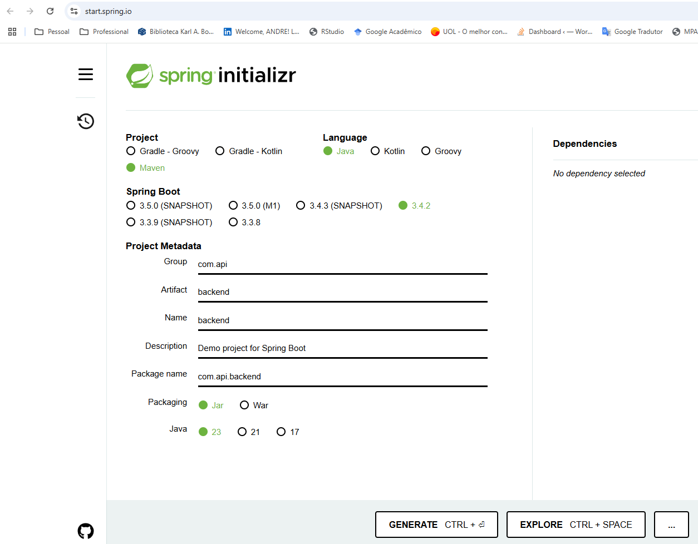

https://www.notion.so/Estrutura-Front-end-119d031f26e080bf8a26f65145e7c9ab

## Memória de comandos

```powershell
mkdir backend
```
```powershell
cd backend
```
## Spring

```powershell
# não deu certo
Invoke-WebRequest "https://start.spring.io/starter.tgz?dependencies=web&type=maven-project&groupId=com.meuprojeto&artifactId=backend" -OutFile backend.zip
Expand-Archive -Path backend.zip -DestinationPath backend
```

Como esse passo acima não deu certo, usei um novo caminho criando um projeto Spring Boot no site [spring initializr](https://start.spring.io/). Segue os parâmetros que eu preenchi:




Na pasta backend eu rodei:

```powershell
# Para o Maven compilar o projeto
mvm clean package
```

```powershell
mvm spring-boot:run
```

Agora acesse o link (http://localhost:8080/api/hello) e você verá a mensagem: "Spring Boot funcionando".